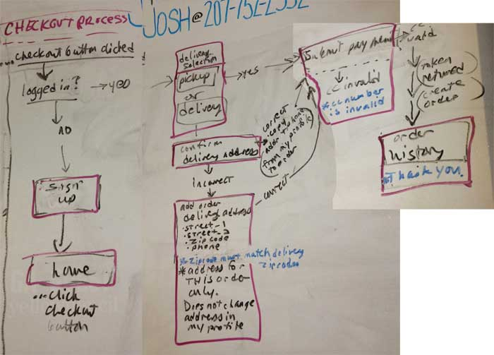
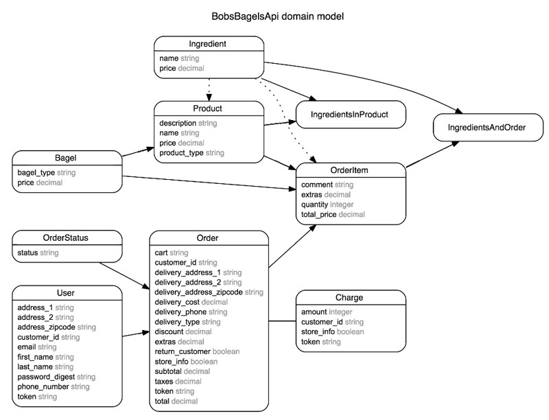
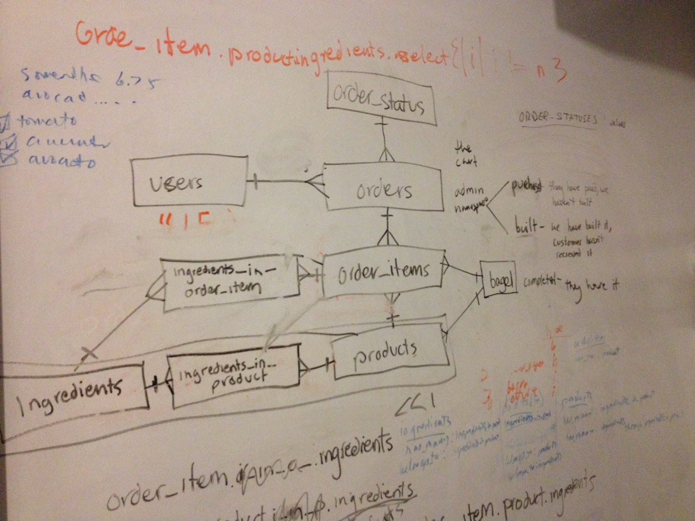
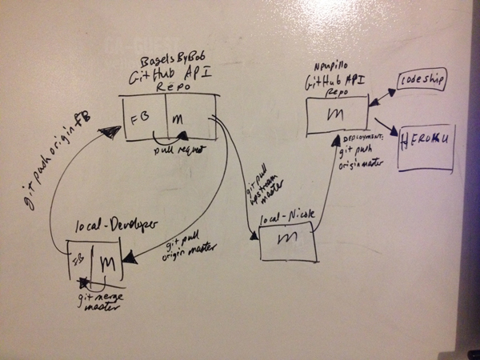

# GA WDI

## Bob's Bagels - Group project with Nicole, Ian, Max & Brandon
- html, css, jquery, javascript, bootstrap, handlebars, json, ajax, ruby on rails api
- Front End deployed to GitHub Pages: http://bagelsbybob.github.io/bobs-bagels-webapp
- Back End API server deployed to Heroku: http://bobs-bagels-api.herokuapp.com/products

## Client Requirements
- menu must be visible on the site
- Bob’s bio must be somewhere on the site
- users can place orders and are billed appropriately (including delivery charges)
- users can see an order history
- users can view an order in progress and change the order before placing it
- users can customize sandwiches by adding items (increasing the price) or removing items (not affecting the price)
- users can pay by credit card (via the Stripe API)

## Checkout Process

## Models - ERD (Entity Relationship Diagrams)
### Auto generated ERD (generated with the Rails ERD Gem)
Diagram generated with [Rails ERD](http://rails-erd.rubyforge.org)

### Whiteboard planning

## Initial GitHub Workflow

## GitHub Workflow with API Deployment Process

## Project Documentation
[Project Documentation - Google Docs](https://docs.google.com/document/d/1tiphkFy_W58ioYVDvyYR1U1YO5Sptzc-Jd03a2EBRR0/edit?usp=sharing)

